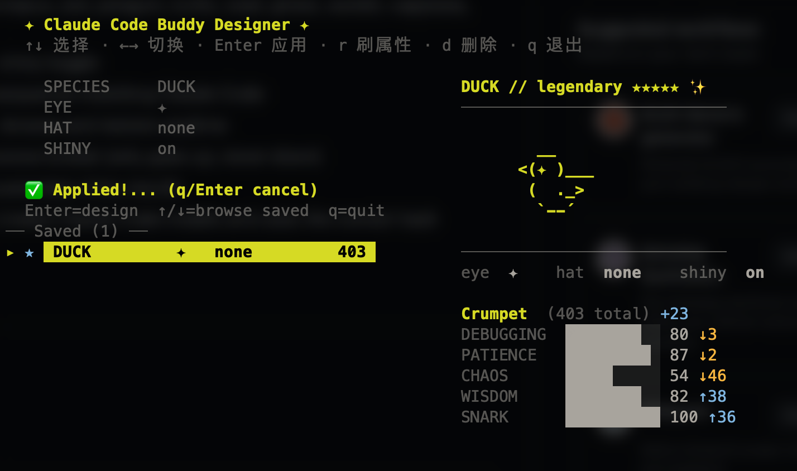
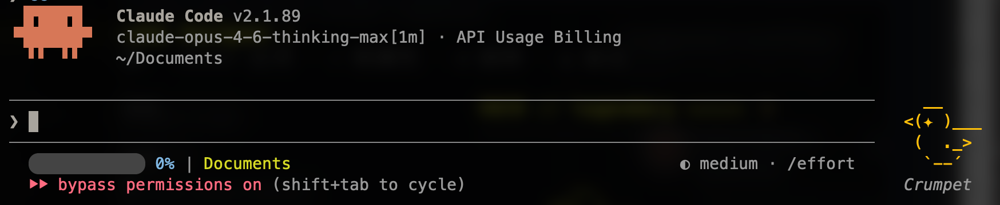
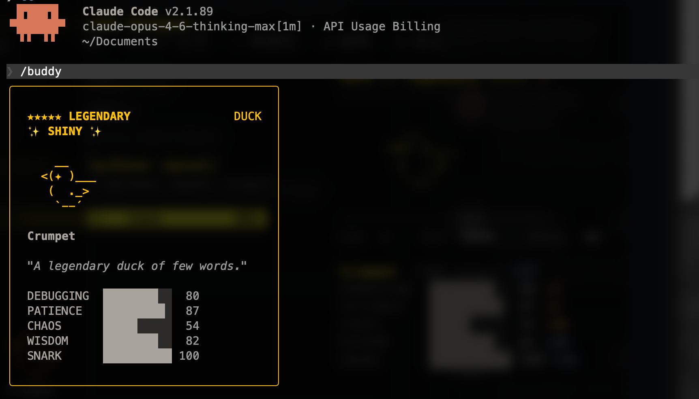

# Claude Buddy Designer

[English](README.md) | [中文](README.zh-CN.md)

交互式终端工具，自定义你的 [Claude Code](https://claude.ai/code) 宠物伙伴。选择种族、眼睛、帽子和闪光效果，一键应用，告别随机。

> **注意：** 仅支持 API key 用户，不支持 OAuth 登录用户。
>
> **要求：** Claude Code **v2.1.89** 及以上版本。使用本工具前，请先在 Claude Code 中执行一次 `/buddy`。



应用后，重启 Claude Code 并执行 `/buddy` 查看效果：




## 功能

- **18 种族** — 鸭子、鹅、果冻、猫、龙、章鱼、猫头鹰、企鹅、乌龟、蜗牛、幽灵、六角恐龙、水豚、仙人掌、机器人、兔子、蘑菇、胖墩
- **完全属性控制** — 种族、眼睛样式、帽子、闪光开关
- **实时预览** — 动画 ASCII 精灵图，与 Claude Code 待机动画一致
- **收藏管理** — 自动保存传说级宠物，随时浏览和恢复
- **属性刷新** — 锁定外观刷属性，只升不降
- **闪光保护** — 刷新闪光宠物时保证闪光不丢失
- **自动检测** — 自动识别原生安装（bun）和 npm 安装（node）的 Claude Code，使用对应的哈希函数

## 安装

### 1. 安装 Bun

```bash
# macOS / Linux
curl -fsSL https://bun.sh/install | bash

# Windows (PowerShell)
powershell -c "irm bun.sh/install.ps1 | iex"

# 或通过 Homebrew
brew install oven-sh/bun/bun
```

### 2. 运行

```bash
bun buddy-designer.mjs
```

### 操作说明

| 按键 | 操作 |
|------|------|
| `↑` `↓` | 选择字段 |
| `←` `→` | 切换选项 |
| `Enter` / `Space` | 应用设计 或 恢复已保存的宠物 |
| `r` | 刷新属性（只升不降） |
| `d` | 删除已保存条目 |
| `q` | 退出 |

## 工作原理

Claude Code 通过 `hash(userID + SALT)` 配合种子伪随机数生成器（[Mulberry32](https://gist.github.com/tommyettinger/46a874533244883189143505d203312c)）确定性地生成宠物属性。本工具通过暴力搜索哈希空间，找到能生成你想要的组合的 userID。

- **原生安装**（通过 `claude` 安装器）使用 `Bun.hash`（wyhash）
- **npm 安装**（通过 `npm i -g @anthropic-ai/claude-code`）使用 FNV-1a

本工具会自动检测你的 Claude Code 使用哪种哈希函数，并据此搜索。

### 修改了什么

仅修改 Claude Code 配置文件（`~/.claude.json` 或等效路径）中的 `userID` 字段。你的认证信息、设置等不受影响。宠物的"灵魂"（名字、性格）写入 `companion` 字段。

## 收藏集

传说级宠物保存在 `~/.claude/buddy-legendaries.json`，每条记录包含：

- 种族、眼睛、帽子、闪光状态
- 完整属性值（DEBUGGING、PATIENCE、CHAOS、WISDOM、SNARK）
- UserID（用于恢复）
- 时间戳

`★` 标记表示当前激活的宠物。

## 常见问题

**Q: 会破坏我的 Claude Code 吗？**
A: 不会。仅修改配置文件中的 `userID`，Claude Code 每次启动时重新计算宠物。认证令牌和设置不受影响。

**Q: 能恢复之前的宠物吗？**
A: 可以。旧的 userID 保存在收藏集中，随时可以恢复。

**Q: OAuth 登录用户能用吗？**
A: 不支持。OAuth 登录用户的宠物由 `oauthAccount.accountUuid` 决定，本工具不会修改该字段。仅支持 API key 用户（宠物由 `userID` 决定）。

**Q: 为什么搜索闪光这么慢？**
A: 闪光概率 1%，叠加传说级约 1% 和特定外观组合，大约千万分之一。耐心等待即可。

**Q: 支持 Linux 吗？**
A: 支持，安装 Bun 即可。部分云服务器可能需要重启 Claude Code 才能生效。

## 许可证

[MIT](LICENSE)
